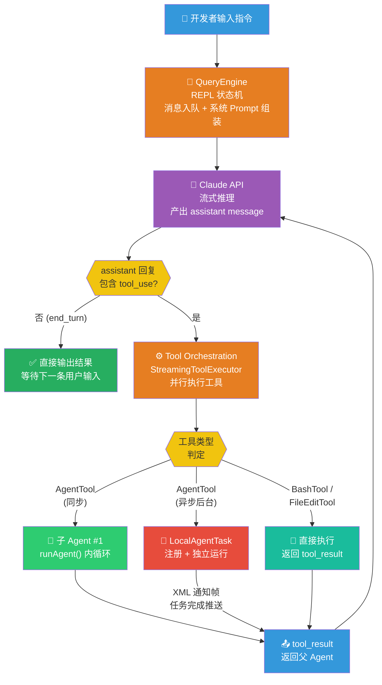
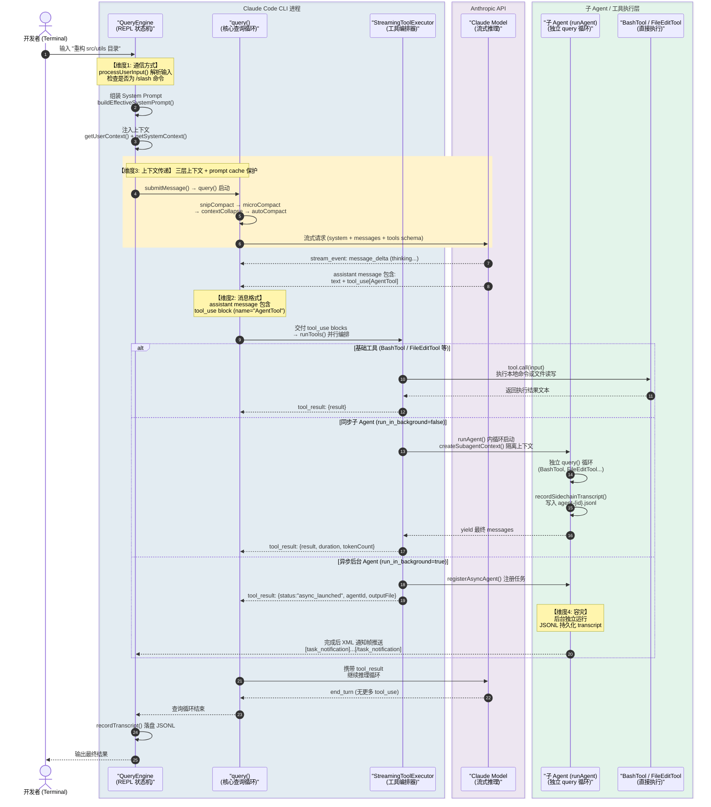
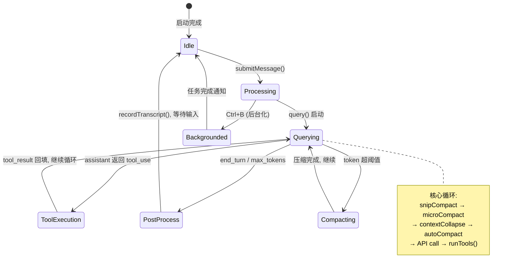
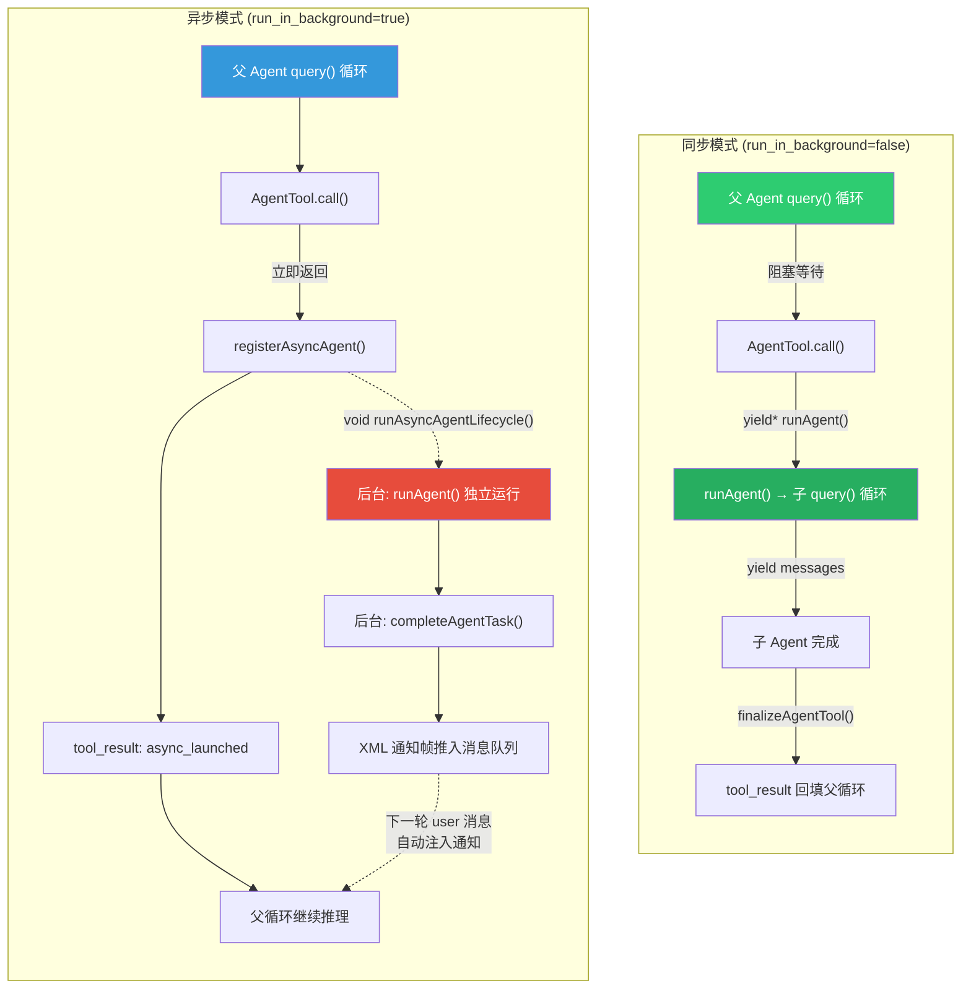
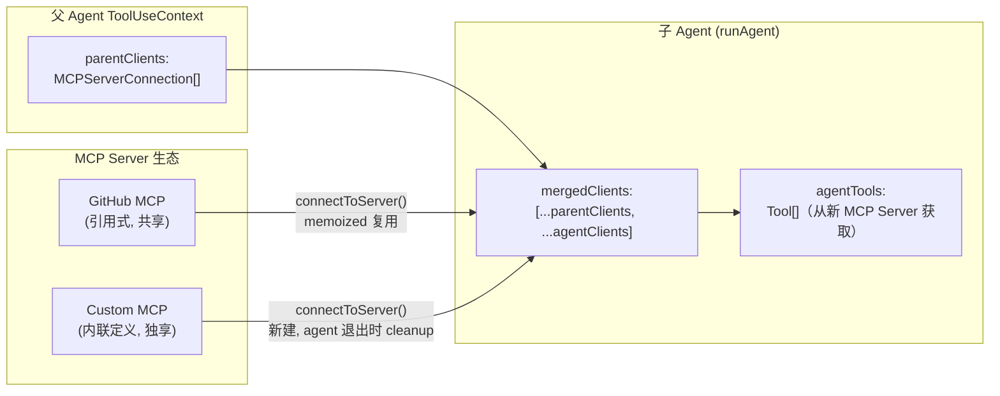
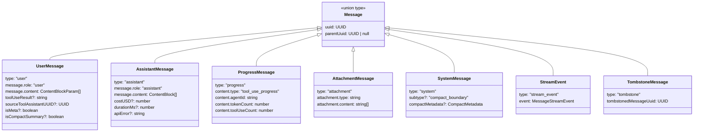
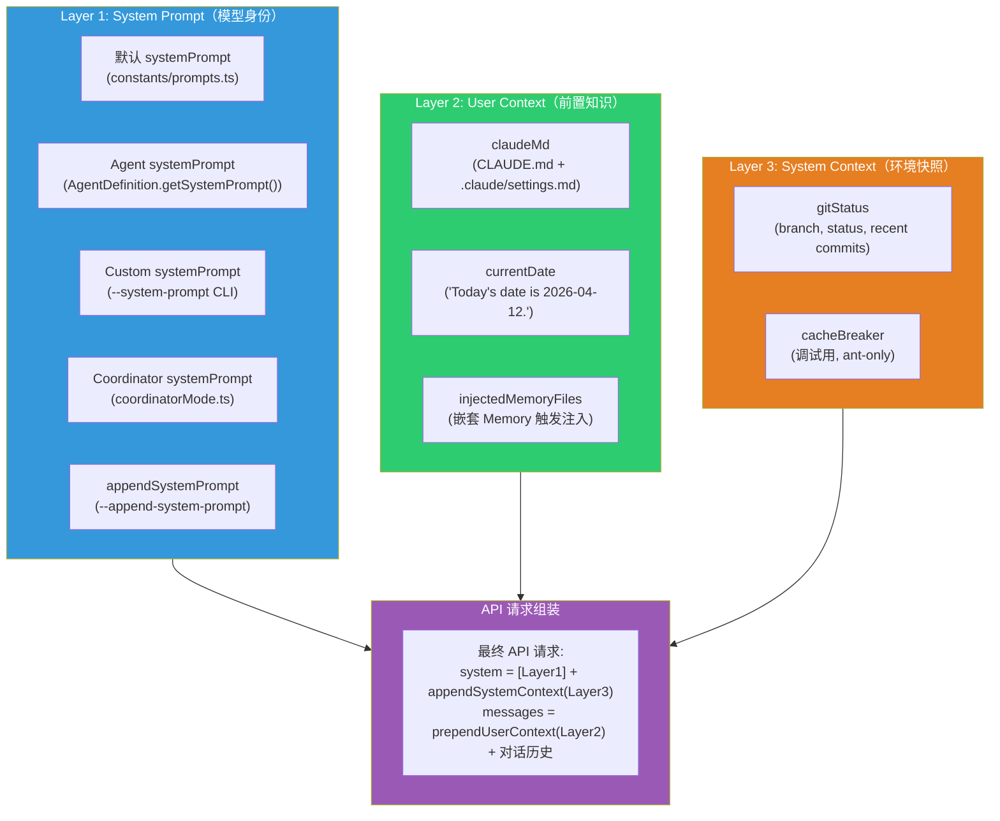
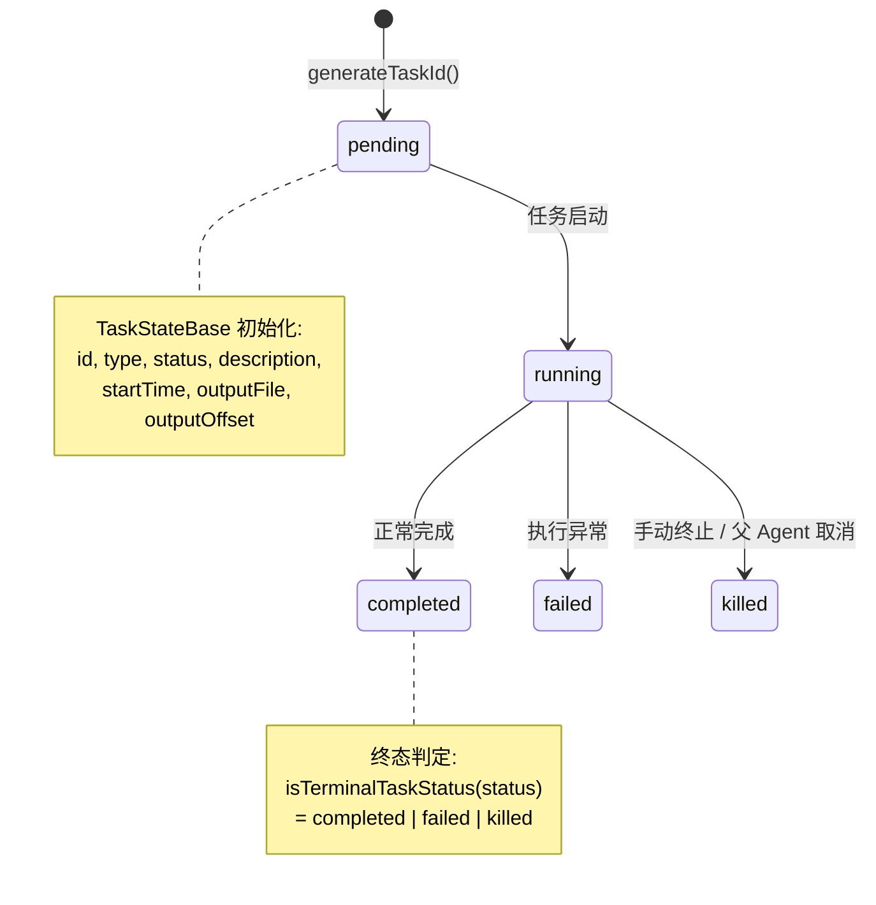
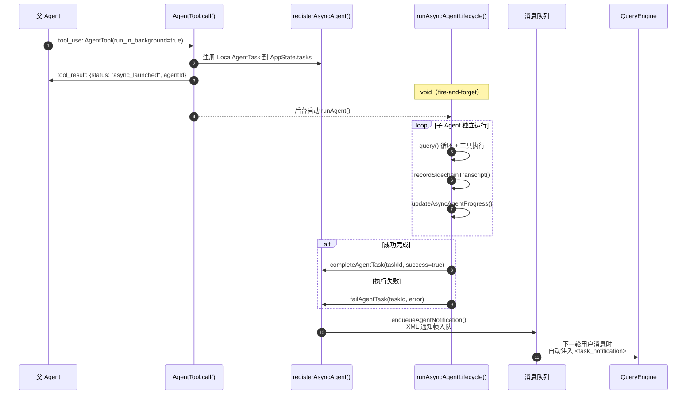

# 📄 Claude Code 多 Agent 深度调研：通信方式 · 消息格式 · 上下文传递 · 任务调度与容灾

> **调研基准版本**：Claude Code (Bun Runtime, 2026-04 latest)
>
> **调研方法**：直接阅读 Claude Code 开源仓库核心模块源码 (`QueryEngine.ts`, `query.ts`, `tools/AgentTool/`, `tasks/`, `utils/forkedAgent.ts`, `utils/sessionStorage.ts`, `services/compact/`, `context.ts`)
>
> **参考对照**：[OpenClaw 多 Agent 深度调研](../../../openclaw/research/OpenClaw%20多Agent深度调研：通信方式·消息格式·上下文传递·任务调度与容灾.md)

---

## 一、四大核心维度深度拆解

当我们从源码层面审视 Claude Code 这一 CLI-Native 的 Agentic Coding 系统时，面对的并非传统 C/S 架构的集中式调度问题，而是一组围绕**单进程 REPL 循环**展开的层层嵌套工程挑战。

> [!NOTE] 架构术语：单进程 REPL 循环
>
> **REPL** (Read-Eval-Print Loop) 在 Claude Code 架构中描述了其作为本地终端工具的运行模式：
> 1. **Read**: `QueryEngine.ts` 监听 `stdin` 等待用户指令。
> 2. **Eval**: 核心执行阶段。`query.ts` 驱动逻辑推理、状态管理及工具执行（Bash/File/Agent）。
> 3. **Print**: `ink` (React for CLI) 将模型思考、工具过程及结果实时渲染到终端。
> 4. **Loop**: 单次任务结束后，系统保持进程运行并回到等待输入状态，形成有状态的闭环。
>
> 与 OpenClaw 的分布式 Gateway 架构（被动接收 Webhook/WebSocket）不同，Claude Code 是一个主动的、状态存在于内存与 JSONL 文件中的本地长驻进程。

本文选取以下四个维度进行逐层递进的深度拆解，其选取逻辑遵循**一次用户指令从输入到完成的完整生命线**：

| 维度 | 核心问题 | 一句话概括 |
|---|---|---|
| **维度 1：通信方式** | 父子 Agent 如何创建、调度与通信？ | QueryEngine 中央编排 + AgentTool 同步/异步 RPC + MCP 外挂协议 |
| **维度 2：消息格式** | Agent 内部传递的是什么"语言"？ | Anthropic API 原生 Schema 驱动 + JSONL 持久化 + XML 结构化通知帧 |
| **维度 3：上下文传递** | 每个 Agent 看到多少信息？如何压缩？ | 三层组装（System/User/SystemContext）+ 五级递进压缩 + CacheSafeParams 缓存共享 |
| **维度 4：任务调度与容灾** | 后台任务崩了怎么办？如何恢复？ | 七类 TaskType 统一状态机 + JSONL Transcript 落盘 + `--resume` 断点续传 |

这四个维度从外到内、从"通路"到"内容"到"记忆"再到"容灾"，恰好覆盖了一个 CLI-Native Agentic Coding 工具在工业级部署中必须回答的全部核心架构问题。

---

## 二、业务场景定义与端到端架构流转

### 2.1 用户路径

开发者在终端执行 `claude "帮我重构 src/utils 目录下所有文件，将公共逻辑提取到 shared 模块"`。

### 2.2 前置条件：Agent 能力体系

在阅读后续架构图前需要明确：Claude Code 的子 Agent 并**不是硬编码写死的特化组件**，而是 `AgentDefinition` 配置驱动的实例。这是 Claude Code 作为"可扩展 Agentic 编码框架"的核心解耦设计：

- **底层框架能力 (Framework) Built-in**：Claude Code 提供核心编排引擎（`QueryEngine` 状态机、`query()` 查询循环、JSONL 持久化）以及标准化工具箱（`BashTool`, `FileReadTool`, `FileEditTool` 等）。
- **Agent 类型定义 (AgentDefinition) Per-configured**：
  - **`Explore` (探索者)**：被配置了 `omitClaudeMd: true` 的只读搜索 Agent，精准定位代码中的上下文信息。
  - **`Plan` (规划者)**：只读分析 Agent，生成实施计划但不直接修改代码。
  - **`general-purpose` (通用执行者)**：具备完整工具箱的执行 Agent，默认子 Agent 类型。
  - **Custom Agents**：用户通过 `.claude/agents/` 目录自定义的 Agent 类型，支持 YAML Frontmatter 定义 `systemPrompt`、`tools`、`mcpServers` 等。

### 2.3 核心流转过程



> **关键机制**: Claude Code 的 Agent 编排是**模型自主推理驱动**的——主 Agent 通过 `tool_use` 块自行决定调用 `AgentTool` 来分派子任务。`QueryEngine` 是状态机管理者，`query()` 是循环执行者，两者不做任何意图判断。

> 💡 **概念解析：什么是 `AgentTool`？**
> `AgentTool` 是 Claude Code 提供给主 Agent 的**内置核心工具（Tool）**，充当了父子 Agent 间"子任务分发"的 RPC 调度机制。
> - **发起**：父 Agent 在推理时主动调用该工具，传入 `{ prompt, description, subagent_type?, run_in_background?, isolation? }` 参数。
> - **执行**：`AgentTool.call()` 根据参数决定同步执行（阻塞父 Agent 等待结果）或异步后台执行（立即返回 `taskId`，后续通过 XML 通知帧回传结果）。
> - **隔离**：子 Agent 在 `createSubagentContext()` 构建的沙箱中运行，拥有独立的 `readFileState`、`abortController`、`agentId` 和 `queryTracking` 链。

### 2.4 场景痛点

- **上下文爆炸**：大型代码库重构涉及数十个文件，每次 API 调用的 context window 占用可能逼近 200K Token 上限
- **长时间后台任务**：异步 Agent 或后台 Bash 命令可能运行数分钟，期间用户需要继续交互
- **Prompt Cache 极端敏感**：Anthropic API 的 Prompt Cache 机制要求前缀字节级一致，任何压缩/裁剪操作都可能导致 Cache 失效，造成数倍成本飙升
- **断点续传必要性**：CLI 进程可能因意外退出、网络中断等原因终止，未完成的多步骤代码修改如果丢失，重做代价极高

### 2.5 端到端时序流转图



---

## 三、通信方式（Communication Mechanism）

### 3.1 核心设计理念

**单进程 REPL 架构下的嵌套式查询循环，通过 tool_use/tool_result 的 RPC 闭环实现父子 Agent 通信，以 AbortController 链路为生命周期管控纽带。**

与 OpenClaw 的 Gateway 中心化中继架构截然不同，Claude Code 采用的是**进程内嵌套调用**模型：子 Agent 不是独立进程，而是父 Agent 的 `query()` 循环内通过 `runAgent()` 再发起一个独立的 `query()` 循环。整个调用栈在同一个 Node.js (Bun) 进程内完成。

```
QueryEngine.submitMessage()
  └─ query() [主循环]
       ├─ API call → assistant message (tool_use: AgentTool)
       ├─ runTools() → AgentTool.call()
       │     └─ runAgent()
       │           └─ query() [子循环, 独立 context]
       │                 ├─ API call → assistant message
       │                 ├─ runTools() → BashTool / FileEditTool
       │                 └─ (递归: 再嵌套 AgentTool)
       └─ tool_result 回填 → 继续主循环
```

### 3.2 QueryEngine — 中央编排状态机

`QueryEngine` (`QueryEngine.ts`, 1296 行) 是 Claude Code 整个会话生命周期的**中央编排器**。它并非一个"路由引擎"，而是一个**有状态的 REPL 控制器**，管理着从用户输入到模型推理再到工具执行的完整闭环。

**QueryEngine 核心职责矩阵：**

| 职责 | 实现方式 | 源码锚点 |
|---|---|---|
| **用户输入处理** | `processUserInput()` 解析 `/slash` 命令、普通文本、图片附件 | `QueryEngine.ts` ~L300+ |
| **系统 Prompt 组装** | `fetchSystemPromptParts()` → `buildEffectiveSystemPrompt()` | `utils/queryContext.ts` → `utils/systemPrompt.ts` |
| **上下文注入** | `getUserContext()` (CLAUDE.md) + `getSystemContext()` (git status) | `context.ts` |
| **查询循环驱动** | 调用 `query()` AsyncGenerator，消费 stream_event / Message | `QueryEngine.ts` ~L500+ |
| **Transcript 持久化** | `recordTranscript()` 将每个 message 追加写入 JSONL | `utils/sessionStorage.ts` |
| **后台任务管理** | `AppState.tasks` 字典管理所有活跃任务 | `state/AppState.ts` |
| **MCP 客户端管理** | `mcpClients` 数组管理所有已连接的 MCP Server | `services/mcp/client.ts` |

**QueryEngine 状态转换逻辑：**



### 3.3 AgentTool — 子 Agent 任务分发的 RPC 机制

`AgentTool` (`tools/AgentTool/AgentTool.tsx`, 1398 行) 是 Claude Code 中父 Agent 向子 Agent 分派任务的**唯一正式通道**。

**AgentTool 完整输入参数（源自 Zod Schema 定义，`AgentTool.tsx` ~L82-102）：**

```json
{
  "description": "重构 src/utils 下的日期处理函数",
  "prompt": "将 src/utils/date.ts 中的日期格式化函数提取到 src/shared/dateFormat.ts，并更新所有引用。需要:\n1. 分析当前所有使用了 formatDate 的文件\n2. 创建新的 shared 模块\n3. 更新所有 import 路径\n4. 运行测试确认无回归",
  "subagent_type": "general-purpose",
  "model": "sonnet",
  "run_in_background": true,
  "isolation": "worktree"
}
```

**字段级释义：**

| 字段 | 类型 | 必填 | 业务作用与架构语义 |
|---|---|---|---|
| `description` | `string` | ✅ | 3-5 个词的短描述，用于通知帧的 `<summary>` 和 UI 展示 |
| `prompt` | `string` | ✅ | 完整的任务指令，作为子 Agent 的第一条 `user` 消息 |
| `subagent_type` | `string?` | ❌ | Agent 类型路由键，匹配 `AgentDefinition.agentType`。默认 `general-purpose` |
| `model` | `enum?` | ❌ | `sonnet` / `opus` / `haiku`。优先级：此参数 > Agent 定义的 model > 父 Agent 模型 |
| `run_in_background` | `boolean?` | ❌ | `true` = 异步后台执行（注册 `LocalAgentTask`），`false` = 同步阻塞父 Agent |
| `isolation` | `enum?` | ❌ | `worktree` = 创建 git 工作树副本隔离；`remote` = 远程 CCR 环境执行 |
| `name` | `string?` | ❌ | 命名 Agent，使其可通过 `SendMessage({to: name})` 被其他 teammate 寻址 |
| `cwd` | `string?` | ❌ | 覆盖工作目录。与 `isolation: "worktree"` 互斥 |

**AgentTool 完整输出结构（源自 Zod Schema 定义，`AgentTool.tsx` ~L141-155）：**

```typescript
// 同步完成
{
  status: 'completed',
  result: string,        // 子 Agent 最终回复文本
  duration: number,      // 执行耗时 (ms)
  tokenCount: number,    // 消耗的 output tokens 
  toolUseCount: number,  // 工具调用总次数
  prompt: string         // 原始输入 prompt
}

// 异步启动
{
  status: 'async_launched',
  agentId: string,       // 任务 ID (用于追踪)
  description: string,   // 任务描述
  prompt: string,        // 原始 prompt
  outputFile: string,    // transcript 文件路径
  canReadOutputFile: boolean // 调用者是否有 Read/Bash 能力检查进度
}
```

#### 3.3.1 同步模式 vs 异步模式的本质区别



> **关键区分**：同步模式下，子 Agent 的 `query()` 嵌套在父 Agent 的 `query()` 内部，共享同一条 `abortController` 链路（通过 `createChildAbortController` 实现父取消传播）。异步模式下，子 Agent 获得一个独立的 `AbortController`（`runAgent.ts` ~L524-528：`isAsync ? new AbortController() : toolUseContext.abortController`），生命周期完全解耦。

### 3.4 多 Agent 团队通信 — Teammate 与 SendMessage

当 `ENABLE_AGENT_SWARMS` 特性门开启时，Claude Code 支持**多 Agent 团队协作**模式。此模式下，Agent 之间通过 `SendMessageTool` 进行**进程间通信**：

```
父 Agent → AgentTool(name: "reviewer") → spawnTeammate()
                                              │
                                              ├─ tmux 新窗格中启动独立 claude 进程
                                              ├─ 通过 mailbox (文件系统) 通信
                                              └─ SendMessage({to: "reviewer", message: "...})
```

这与 OpenClaw 的 `sessions_spawn` 有本质区别：OpenClaw 的子 Agent 是同一进程内的逻辑隔离，Claude Code 的 teammate 是**独立进程**的物理隔离。

### 3.5 子 Agent Spawn 的安全管控机制

Claude Code 通过以下协同机制防止 Agent 无限递归（Fork Bomb）：

| 防护机制 | 实现位置 | 作用 |
|---|---|---|
| `queryTracking.depth` | `forkedAgent.ts` ~L452-455 | 每嵌套一层深度 +1，可用于深度限制 |
| `maxTurns` | `query.ts` ~L191 | 子 Agent 的最大 API 往返次数 |
| `shouldAvoidPermissionPrompts` | `forkedAgent.ts` ~L362-374 | 异步 Agent 无法弹出 UI 权限对话框，自动拒绝需要确认的操作 |
| `filterDeniedAgents()` | `permissions.ts` | 权限系统过滤不允许的 Agent 类型 |
| `abortController` 级联 | `abortController.ts` | 父 Agent 取消时，所有同步子 Agent 自动取消 |
| Agent 白名单 (`allowedAgents`) | `AgentDefinition` | 限制 Agent 可以 spawn 的子 Agent 类型 |

### 3.6 MCP（Model Context Protocol）— 标准化外挂通信

Claude Code 是 MCP 的**一等公民**。每个 Agent（包括子 Agent）可以通过 `AgentDefinition.mcpServers` 配置来挂载额外的 MCP Server：



**关键实现细节**（`runAgent.ts` ~L95-218）：

1. **引用式 MCP Server**（`mcpServers: ["github"]`）：通过名称查找全局 MCP 配置，`connectToServer()` 是 memoized 的，复用父 Agent 已连接的客户端。Agent 退出时**不清理**。
2. **内联定义 MCP Server**（`mcpServers: [{"custom-server": {command: "npx", args: [...]}}]`）：Agent 启动时新建连接，退出时**主动清理** `client.cleanup()`。
3. **Plugin-Only 策略**：当 `strictPluginOnlyCustomization` 启用时，用户自定义 Agent 的 MCP Server 被静默跳过（`runAgent.ts` ~L117-127）。

### 3.7 Fork Agent — 轻量级旁路推理通信

除了 `AgentTool` 的重量级子 Agent 机制，Claude Code 还有一种轻量级的**旁路推理**机制：`runForkedAgent()`（`utils/forkedAgent.ts`, 690 行）。

**Fork Agent 与 AgentTool 的核心区别：**

| 维度 | AgentTool (runAgent) | Fork Agent (runForkedAgent) |
|---|---|---|
| **用途** | 用户可见的子任务分发 | 系统内部的旁路推理（session_memory, 摘要, /btw） |
| **上下文** | 可选择继承或独立 | **强制共享父 Agent 的 prompt cache 前缀** |
| **触发者** | 模型通过 tool_use 主动触发 | 系统钩子/后处理逻辑自动触发 |
| **transcript** | 独立的 `agent-{id}.jsonl` | 可配置的 sidechain transcript（`skipTranscript` 可关闭） |
| **关键参数** | `CacheSafeParams` (可选) | `CacheSafeParams` (**必须**，确保缓存命中) |

**CacheSafeParams 数据结构（`forkedAgent.ts` ~L57-68）：**

```typescript
type CacheSafeParams = {
  systemPrompt: SystemPrompt       // 必须与父 Agent 一致
  userContext: { [k: string]: string }  // claudeMd + currentDate
  systemContext: { [k: string]: string } // gitStatus
  toolUseContext: ToolUseContext    // 包含 tools schema, model 等
  forkContextMessages: Message[]   // 父 Agent 的消息前缀（prompt cache 键）
}
```

> ⚠️ **Prompt Cache 敏感度警示**（`forkedAgent.ts` ~L46-56）：
> Anthropic API 的 prompt cache 键由 `system prompt + tools + model + messages 前缀 + thinking config` 组成。Fork Agent 必须使用完全一致的 `CacheSafeParams` 来复用父 Agent 的 cache。如果设置了 `maxOutputTokens`（会影响 `budget_tokens` 从而改变 thinking config），**缓存将失效**——文档明确标记此为 CAUTION。

### 3.8 关键调用链（源码锚点）

通信域的代码组织遵循**"编排 → 分发 → 执行 → 持久化"**四层架构：

1. **QueryEngine 入口**
   `QueryEngine.ts` ~L300+：`submitMessage()` → `processUserInput()` → 构建消息 → 调用 `query()`。

2. **query() 核心循环**
   `query.ts` ~L219-239：`query()` 外壳 → `queryLoop()` 内部 AsyncGenerator。每次循环迭代包含：上下文压缩 → API 调用 → 工具执行 → 状态更新。

3. **AgentTool 分发决策**
   `AgentTool.tsx` ~L196+：`call()` 方法根据 `run_in_background`、`isolation`、`team_name` 等参数路由到不同的执行路径——`runAgent()`（同步）、`runAsyncAgentLifecycle()`（异步）、`spawnTeammate()`（多 Agent 团队）、`teleportToRemote()`（远程执行）。

4. **runAgent() 子 Agent 生命周期**
   `runAgent.ts` ~L248-329：创建 `SubagentContext` → 初始化 Agent MCP → 构建系统 Prompt → 启动独立 `query()` 循环 → 逐条写入 sidechain transcript → 清理资源。

5. **ForkedAgent 旁路推理**
   `forkedAgent.ts` ~L489-626：`runForkedAgent()` — 从 `CacheSafeParams` 构建隔离上下文 → 运行 `query()` 并累计 usage → 记录 sidechain transcript → 发布 `tengu_fork_agent_query` 遥测事件。

---

## 四、消息格式（Message Format）

### 4.1 核心设计理念：Anthropic API 原生 Schema 驱动

**直接使用 Anthropic Messages API 的原生数据结构作为系统内部通信契约，在此基础上扩展 metadata 字段以支撑持久化、压缩和恢复需求。**

与 OpenClaw 自研的 `AgentMessage` 格式不同，Claude Code 的内部消息格式是 Anthropic API 原生 Schema 的**超集**——每条消息的 `message` 字段就是标准的 `MessageParam`，外层包裹了 `uuid`、`parentUuid`、`toolUseResult` 等持久化所必需的元数据。

### 4.2 Message 类型体系 — 完整联合类型族

Claude Code 的 `Message` 是一个**判别联合类型**（Discriminated Union），通过 `type` 字段区分 7 种核心消息类型：



**Attachment 类型枚举（关键的上下文注入载体）：**

| attachment.type | 作用 | 注入时机 |
|---|---|---|
| `file` | 文件内容注入 | 压缩后重建文件上下文 |
| `memory` | CLAUDE.md / Memory 文件 | 每轮查询前 |
| `hook_additional_context` | Hook 注入的额外上下文 | SessionStart / SubagentStart |
| `skill_discovery` | 技能发现结果 | 写操作前预取 |
| `skill_listing` | 已加载技能列表 | 首次/压缩后 |
| `agent_listing_delta` | Agent 列表变更增量 | 压缩后重建 |
| `deferred_tools_delta` | 延迟加载工具增量 | 压缩后重建 |
| `mcp_instructions_delta` | MCP 使用说明增量 | 压缩后重建 |

### 4.3 完整工具闭环帧示例（ToolUse 发起与 ToolResult 回执）

当主 Agent 决定派发子任务时，Anthropic API 返回的 assistant message 内含 `tool_use` 块：

**1. 模型发起 tool_use（assistant → 系统）：**
```json
{
  "type": "assistant",
  "uuid": "a1b2c3d4-...",
  "parentUuid": "user-msg-uuid-...",
  "message": {
    "role": "assistant",
    "content": [
      {
        "type": "thinking",
        "thinking": "用户需要重构数十个文件，这是一个大型任务，我应该启动一个后台 Agent 来处理..."
      },
      {
        "type": "text",
        "text": "我来启动一个后台 Agent 来处理这个重构任务。"
      },
      {
        "type": "tool_use",
        "id": "toolu_01XFG7...",
        "name": "AgentTool",
        "input": {
          "description": "重构 utils 模块",
          "prompt": "将 src/utils 下的公共逻辑提取到 shared 模块...",
          "run_in_background": true,
          "subagent_type": "general-purpose"
        }
      }
    ]
  },
  "costUSD": 0.0234,
  "durationMs": 3580
}
```

**2. 系统回填 tool_result（系统 → 模型，作为 user 消息）：**
```json
{
  "type": "user",
  "uuid": "e5f6g7h8-...",
  "parentUuid": "a1b2c3d4-...",
  "message": {
    "role": "user",
    "content": [
      {
        "type": "tool_result",
        "tool_use_id": "toolu_01XFG7...",
        "is_error": false,
        "content": [
          {
            "type": "text",
            "text": "{\"status\":\"async_launched\",\"agentId\":\"a8kg2fm1\",\"description\":\"重构 utils 模块\",\"prompt\":\"将 src/utils 下的公共逻辑提取到 shared 模块...\",\"outputFile\":\"/Users/dev/.claude/projects/.../a8kg2fm1/subagents/agent-a8kg2fm1.jsonl\"}"
          }
        ]
      }
    ]
  },
  "toolUseResult": "{\"status\":\"async_launched\"...}",
  "sourceToolAssistantUUID": "a1b2c3d4-..."
}
```

**字段级释义**：`tool_use_id` 是 Anthropic API 级别的闭环锚点——当一轮 assistant 回复中包含多个 `tool_use` 块时（例如同时启动 3 个子 Agent + 2 个文件读取），系统必须为每个 `tool_use_id` 配对一个 `tool_result`。`query.ts` 中的 `yieldMissingToolResultBlocks()` （~L123-149）专门处理因异常中断导致的未配对 tool_use，补填 `is_error: true` 的结果以防 API 拒绝请求。

### 4.4 异步 Agent 任务生命周期通知帧

异步 Agent 完成后，系统通过**结构化 XML 通知帧**将结果注入主对话流：

```xml
<task_notification>
<task_id>a8kg2fm1</task_id>
<tool_use_id>toolu_01XFG7...</tool_use_id>
<output_file>/Users/dev/.claude/projects/.../agent-a8kg2fm1.jsonl</output_file>
<status>completed</status>
<summary>Background agent "重构 utils 模块" completed</summary>
</task_notification>
```

**XML 标签语义映射（源自 `constants/xml.ts`）：**

| 标签 | 作用 |
|---|---|
| `<task_notification>` | 根容器，标识一条任务通知 |
| `<task_id>` | 任务标识符，用于 `AppState.tasks` 字典查找状态 |
| `<tool_use_id>` | 回溯到触发此任务的原始 tool_use 块 |
| `<output_file>` | 子 Agent 的 JSONL transcript 文件路径 |
| `<status>` | `completed` / `failed` 终态标记 |
| `<summary>` | 人类可读的完成摘要 |

> 💡 **为何选择 XML 而非 JSON？**
> 这是一个深思熟虑的设计。Claude 模型在训练中天然理解 XML 标签语义（大量训练数据中使用 XML 结构），而通知帧是**注入到 user message 文本中**供模型理解的——不是系统间的结构化通信。XML 标签让模型能自然地理解"这是一个任务完成通知"，而 JSON 在纯文本上下文中的可读性更差。

### 4.5 Sidechain Transcript — JSONL 持久化序列化格式

每个 Agent（包括主对话和子 Agent）的对话过程都以 **JSONL（JSON Lines）** 格式持久化到磁盘：

**文件路径规范：**
```
~/.claude/projects/{sanitized_cwd}/
├── {sessionId}.jsonl                    ← 主对话 transcript
├── {sessionId}/subagents/
│   ├── agent-{agentId1}.jsonl           ← 子 Agent transcript
│   ├── agent-{agentId1}.meta.json       ← Agent 元数据
│   └── workflows/{runId}/
│       └── agent-{agentId2}.jsonl       ← 工作流子 Agent transcript
└── {sessionId}/remote-agents/
    └── remote-agent-{taskId}.meta.json  ← 远程 Agent 元数据
```

**JSONL Entry 联合类型（`types/logs.ts` 中的 `Entry` 类型）：**

| Entry type | 用途 | 关键字段 |
|---|---|---|
| `TranscriptMessage` | user / assistant / attachment / system 消息 | `uuid`, `parentUuid`, `message` |
| `custom-title` | 会话自定义标题 | `customTitle`, `sessionId` |
| `tag` | 会话标签 | `tag`, `sessionId` |
| `last-prompt` | 最后用户输入 | `lastPrompt` |
| `agent-name` / `agent-color` | Agent 显示属性 | `agentName`, `agentColor` |
| `content-replacement` | 工具结果替换记录 | 用于 resume 时重建 contentReplacementState |
| `context-collapse-commit` | 上下文折叠提交记录 | 折叠的消息 UUID 列表 |
| `context-collapse-snapshot` | 上下文折叠快照 | 完整的折叠状态 |

**parentUuid 链式结构——对话拓扑重建的基石：**

```
user(uuid=A, parentUuid=null)   ← 会话入口
  └─ assistant(uuid=B, parentUuid=A)
       ├─ user(uuid=C, parentUuid=B)     ← tool_result
       │    └─ assistant(uuid=D, parentUuid=C)
       └─ user(uuid=E, parentUuid=B)     ← 另一个 tool_result（并行）
            └─ assistant(uuid=F, parentUuid=E)
```

> **关键实现细节**（`sessionStorage.ts` ~L139-156）：`isTranscriptMessage()` 是**唯一的真相来源**，决定哪些 entry 类型参与 transcript 链加载。`progress` 类型消息**明确被排除**——它们是临时 UI 状态，不参与 `parentUuid` 链（PR #14373, #23537 修复了因包含 progress 导致的链分叉 bug）。

### 4.6 关键调用链（源码锚点）

1. **消息创建**
   `utils/messages.ts`：`createUserMessage()`, `createAssistantAPIErrorMessage()`, `createCompactBoundaryMessage()` — 所有消息的工厂函数，自动分配 `uuid` 和 `parentUuid`。

2. **Transcript 写入**
   `utils/sessionStorage.ts` ~L532+：`Project` 类实现了**批量异步写入队列**（`enqueueWrite()` → `scheduleDrain()` → `drainWriteQueue()`，100ms 聚合间隔），配合 `MAX_CHUNK_BYTES = 100MB` 分块写入防 OOM。

3. **Sidechain Transcript**
   `utils/sessionStorage.ts` ~L247-258：`getAgentTranscriptPath()` 计算子 Agent 的 JSONL 路径；`recordSidechainTranscript()` 负责增量追加写入，每条消息附带 `parentUuid` 维护链式结构。

4. **消息序列化安全**
   `utils/slowOperations.ts`：`jsonStringify()` 和 `jsonParse()` 封装了对大消息的序列化/反序列化，避免同步阻塞主线程。

---

## 五、上下文传递逻辑（Context Delivery Logic）

### 5.1 核心设计理念

**三层上下文静态组装（System / User / SystemContext）+ 五级递进式动态压缩策略，以 CacheSafeParams 为缓存一致性纽带，在 Token 预算约束下实现最大信息密度。**

与 OpenClaw 的 Context Engine 插件化架构不同，Claude Code 的上下文管理是**深度融合在 query 循环流水线中**的——每一次 API 调用前，上下文都经历一条固定的处理流水线。

### 5.2 三层上下文组装架构



**API 请求的最终构造（`query.ts` ~L449-451 + `utils/api.ts`）：**

```typescript
// 1. System Prompt 组装
const fullSystemPrompt = asSystemPrompt(
  appendSystemContext(systemPrompt, systemContext)
  //                  ^^^^^^^^        ^^^^^^^^^^^^^
  //                  Layer 1         Layer 3 追加
)

// 2. Messages 前置 User Context
// prependUserContext 将 claudeMd, currentDate 等作为第一条 user 消息注入
const messagesForAPI = prependUserContext(messagesForQuery, userContext)
//                                                          ^^^^^^^^^
//                                                          Layer 2 前置
```

### 5.3 System Prompt 五级优先级装配机制

`buildEffectiveSystemPrompt()` (`utils/systemPrompt.ts`, L41-123) 实现了严格的优先级覆盖链：

```
优先级 0 (最高): overrideSystemPrompt     → 完全替换，其他全部忽略
优先级 1:        coordinatorMode prompt    → 仅在 coordinator 模式 + 无 mainThreadAgent 时
优先级 2:        Agent systemPrompt        → AgentDefinition.getSystemPrompt()
  ├─ proactive 模式: APPEND 到默认 prompt（Agent 指令叠加在自治 prompt 上）
  └─ 标准模式: REPLACE 默认 prompt（Agent 完全接管）
优先级 3:        customSystemPrompt        → --system-prompt CLI 参数
优先级 4 (最低): defaultSystemPrompt       → 标准 Claude Code prompt

+ appendSystemPrompt 总是追加在末尾（除 override 模式外）
```

> **设计要点**：Agent 在 proactive 模式下是 **APPEND** 而非 REPLACE。这是因为 proactive agent 需要保留"自治 Agent 身份认知 + 环境感知 + proactive 行为指令"的基础能力，Agent 定义只添加领域专属指令（与 teammate 一致的模式）。

### 5.4 上下文压缩体系 — 五层递进式压缩

这是 Claude Code 上下文管理最复杂、最关键的子系统。每次 API 调用前，消息序列经过以下**严格有序**的压缩管线：


#### 5.4.1 SnipCompact（弹药裁剪）

- **门控**：`feature('HISTORY_SNIP')`
- **源码**：`services/compact/snipCompact.js`
- **机制**：裁剪早期对话中的冗余消息（如过长的 tool_result），释放 token 空间
- **位置**：`query.ts` ~L401-410
- **输出**：`snipResult.tokensFreed` — 被裁剪的 token 估算量，传递给下游 autocompact 用于阈值计算

#### 5.4.2 MicroCompact（微压缩）

- **源码**：`services/compact/microCompact.ts`, `services/compact/apiMicrocompact.ts`
- **机制**：对单条工具结果（tool_result）进行截断或摘要，不涉及跨消息聚合
- **位置**：`query.ts` ~L413-426
- **特性**：支持 `CACHED_MICROCOMPACT` 门控，可延迟到 API 响应后再发出 boundary 消息以利用 `cache_deleted_input_tokens` 指标

#### 5.4.3 Context Collapse（上下文折叠）

- **门控**：`feature('CONTEXT_COLLAPSE')`
- **源码**：`services/contextCollapse/index.js`
- **机制**：将对话历史中的连续工具交互段落折叠为摘要，保留最近的完整交互
- **位置**：`query.ts` ~L440-447
- **与 AutoCompact 的关系**：Context Collapse 激活时，AutoCompact 被抑制（`autoCompact.ts` ~L215-223），因为 collapse 已经承担了上下文管理职责

#### 5.4.4 AutoCompact（自动摘要压缩）

这是最核心的压缩机制，当消息总 token 逼近上下文窗口阈值时自动触发：

**触发条件计算（`autoCompact.ts` ~L72-91）：**

```
effectiveContextWindow = getContextWindowForModel(model) - MAX_OUTPUT_TOKENS_FOR_SUMMARY(20K)
autoCompactThreshold = effectiveContextWindow - AUTOCOMPACT_BUFFER_TOKENS(13K)

示例 (Claude Sonnet, 200K context):
  effectiveWindow = 200,000 - 20,000 = 180,000
  threshold = 180,000 - 13,000 = 167,000 tokens
  ↳ 当消息 token 估算 ≥ 167K 时触发
```

**压缩流程（`compact.ts` ~L387-763）：**

1. 执行 `PreCompact` hooks（用户自定义压缩指令）
2. 调用 `streamCompactSummary()` — 使用 **fork agent** 来生成对话摘要（复用父 Agent 的 prompt cache）
3. 处理 `prompt_too_long` 回退：`truncateHeadForPTLRetry()` 逐步裁剪最早的消息轮次
4. 清空 `readFileState` 缓存，重建最重要的文件上下文（最多 5 个文件，每文件 5K token）
5. 重新注入技能、工具、Agent 列表等增量 attachment
6. 执行 `SessionStart` hooks + `PostCompact` hooks
7. 创建 `compact_boundary` 标记消息，记录压缩前后 token 对比

**电路断路器（`autoCompact.ts` ~L260-265）：**
```
MAX_CONSECUTIVE_AUTOCOMPACT_FAILURES = 3
连续失败 3 次后停止重试 → 避免 API 算力浪费
(BQ 数据：2026-03-10 有 1,279 个 session 累计 50+ 次失败，日均浪费 ~250K API 调用)
```

#### 5.4.5 ReactiveCompact（响应式紧急压缩）

- **门控**：`feature('REACTIVE_COMPACT')`
- **源码**：`services/compact/reactiveCompact.js`
- **触发时机**：API 返回 `prompt_too_long` 错误时的紧急回退
- **与 AutoCompact 的区别**：AutoCompact 是**预防性**的（到达阈值前触发），ReactiveCompact 是**应急性**的（真正溢出后补救）

### 5.5 子 Agent 上下文隔离机制 — createSubagentContext

`createSubagentContext()` (`forkedAgent.ts` ~L345-461) 是子 Agent 上下文隔离的**核心工厂函数**。它遵循**默认隔离、显式共享**原则：

**隔离矩阵：**

| 状态 | 默认行为 | 显式共享选项 |
|---|---|---|
| `readFileState` | **CLONE** from parent | `overrides.readFileState` |
| `abortController` | **NEW** child controller (父取消传播) | `shareAbortController: true` |
| `getAppState` | **WRAPPED** (添加 shouldAvoidPermissionPrompts) | `overrides.getAppState` |
| `setAppState` | **NO-OP** (静默丢弃) | `shareSetAppState: true` |
| `setResponseLength` | **NO-OP** | `shareSetResponseLength: true` |
| `nestedMemoryAttachmentTriggers` | **FRESH** (new Set) | — |
| `toolDecisions` | **undefined** (关闭) | — |
| `contentReplacementState` | **CLONE** from parent | `overrides.contentReplacementState` |
| `queryTracking` | **NEW** chain (depth + 1) | — |
| `agentId` | **NEW** (createAgentId()) | `overrides.agentId` |

> **为何 contentReplacementState 默认 CLONE 而非 FRESH？**（`forkedAgent.ts` ~L389-403）
> 
> 这是一个精妙的 prompt cache 优化。Fork Agent 处理父消息时，消息中包含父 Agent 的 `tool_use_id`。如果使用 FRESH 状态，fork 会认为这些是"从未见过的"ID，做出不同的替换决策 → API 请求的消息前缀不同 → prompt cache miss。CLONE 则保证相同的决策 → 相同的前缀 → cache hit。

### 5.6 Prompt Cache 共享与防护

Prompt Cache 机制是 Claude Code 成本控制的**命门**。每次 API 调用后，系统会检测 cache 命中率并发出遥测：

**Fork Agent 的 cache 统计（`forkedAgent.ts` ~L646-688）：**

```typescript
cacheHitRate = cache_read_input_tokens 
             / (input_tokens + cache_creation_input_tokens + cache_read_input_tokens)
```

**Cache 破坏检测（`services/api/promptCacheBreakDetection.ts`）：**
- `notifyCompaction()` 在每次压缩操作后重置 cache 基线
- 避免压缩导致的 cache read 下降被误判为"cache break"
- BQ 数据显示：未重置时 20% 的 `tengu_prompt_cache_break` 事件是误报

**子 Agent 的 Cache 节省策略（`runAgent.ts` ~L386-410）：**

| Agent 类型 | 优化 | 年化节省 |
|---|---|---|
| `Explore` / `Plan` | 省略 `claudeMd` (CLAUDE.md) | ~5-15 Gtok/week |
| `Explore` / `Plan` | 省略 `gitStatus` | ~1-3 Gtok/week |
| One-shot Agent | 省去 `env details` | 减少 system prompt size |

### 5.7 CLAUDE.md 与 Memory 文件 — 长期记忆注入

Claude Code 的长期记忆系统通过文件系统层级实现：

```
项目根目录/
├── CLAUDE.md              ← 项目级指令 (团队共享, git tracked)
├── CLAUDE.local.md        ← 本地私有指令 (gitignored)
├── .claude/
│   ├── settings.md        ← 项目配置
│   └── agents/            ← 自定义 Agent 定义
└── src/
    └── utils/
        └── CLAUDE.md      ← 目录级指令 (嵌套发现)

~/.claude/
├── CLAUDE.md              ← 全局用户指令
└── settings.md            ← 全局配置
```

**注入机制（`context.ts` ~L155-189 + `utils/claudemd.ts`）：**

1. `getMemoryFiles()` — 异步扫描 cwd 向上所有层级的 CLAUDE.md 文件
2. `filterInjectedMemoryFiles()` — 过滤已注入的 memory 文件（避免重复）
3. `getClaudeMds()` — 将所有文件内容合并为单个 `claudeMd` 字符串
4. 结果作为 `userContext.claudeMd` 键注入 Layer 2（每轮查询前预置）

**环境感知覆盖（`context.ts` ~L162-167）：**
```typescript
// 完全禁用 CLAUDE.md
CLAUDE_CODE_DISABLE_CLAUDE_MDS=true

// --bare 模式：跳过自动发现，但保留 --add-dir 显式指定的
isBareMode() && getAdditionalDirectoriesForClaudeMd().length === 0
```

### 5.8 关键调用链（源码锚点）

上下文域的代码组织遵循**"组装 → 压缩 → 注入 → 保护"**四层架构：

1. **三层上下文组装**
   - `context.ts`：`getUserContext()` (memoized) + `getSystemContext()` (memoized)
   - `utils/systemPrompt.ts`：`buildEffectiveSystemPrompt()` 五级优先级装配
   - `utils/api.ts`：`prependUserContext()` + `appendSystemContext()` 最终注入

2. **五级压缩管线**
   - `query.ts` ~L396-467：`applyToolResultBudget()` → `snipCompact()` → `microcompact()` → `applyCollapsesIfNeeded()` → `autoCompactIfNeeded()`
   - 每级的输入是上一级的输出，管线内严格有序

3. **子 Agent 隔离**
   - `utils/forkedAgent.ts` ~L345-461：`createSubagentContext()` 工厂函数
   - `runAgent.ts` ~L370-378：决定 CLONE vs FRESH 的 `readFileState`

4. **Cache 保护**
   - `utils/forkedAgent.ts` ~L57-68：`CacheSafeParams` 类型定义
   - `utils/forkedAgent.ts` ~L73-81：`saveCacheSafeParams()` / `getLastCacheSafeParams()` — 模块级全局缓存，供 post-turn fork（promptSuggestion, postTurnSummary, /btw）复用主循环的 cache 前缀

---

## 六、任务调度与容灾机制（Task Scheduling & Fault Tolerance）

### 6.1 核心设计理念

**七类 TaskType 共享统一状态机（pending → running → completed/failed/killed），以 JSONL Transcript 文件为持久化底座，通过 `--resume` 命令实现 session 级断点续传。**

与 OpenClaw 的三层状态机（Flow/Task/Run）和 SQLite 持久化不同，Claude Code 的任务系统更加**扁平化**——没有 Flow 级别的编排层，每个任务直接注册在 `AppState.tasks` 字典中，状态持久化依赖 JSONL 文件而非关系型数据库。

### 6.2 七类任务类型与统一状态机

**TaskType 枚举（`Task.ts` ~L6-14）：**

| TaskType | 用途 | 典型场景 |
|---|---|---|
| `local_bash` | 后台 Shell 命令 | 长时间运行的 `npm test`、`make build` |
| `local_agent` | 异步子 Agent | `AgentTool(run_in_background=true)` |
| `remote_agent` | 远程 Agent (CCR) | `AgentTool(isolation="remote")` |
| `in_process_teammate` | 进程内 Teammate | 多 Agent 团队模式的内存内协作者 |
| `local_workflow` | 本地工作流 | 多步骤自动化编排 |
| `monitor_mcp` | MCP 监控任务 | 长期运行的 MCP Server 监听 |
| `dream` | 自治推理任务 | 后台自主探索 (实验性) |

**统一状态机：**



**任务 ID 生成规则（`Task.ts` ~L78-106）：**

```
ID 格式: {prefix}{random_8_chars}
前缀映射:
  local_bash         → 'b'  (如 b3kf82m1)
  local_agent        → 'a'  (如 a7gx4pn2)
  remote_agent       → 'r'
  in_process_teammate → 't'
  local_workflow     → 'w'
  monitor_mcp        → 'm'
  dream              → 'd'

字符集: 0-9a-z (36 进制, 36^8 ≈ 2.8 万亿组合，抵御符号链接暴力攻击)
```

### 6.3 TaskStateBase — 统一任务元数据结构

**所有任务类型共享的基础字段（`Task.ts` ~L45-57）：**

```typescript
type TaskStateBase = {
  id: string            // 带类型前缀的唯一标识
  type: TaskType        // 七类之一
  status: TaskStatus    // pending | running | completed | failed | killed
  description: string   // 人类可读的任务描述
  toolUseId?: string    // 触发此任务的 tool_use block ID
  startTime: number     // Date.now() 时间戳
  endTime?: number      // 完成时间戳
  totalPausedMs?: number // 累计暂停时长（用于精确计时）
  outputFile: string    // 输出文件路径 (symlink → transcript)
  outputOffset: number  // 已读取的输出偏移量
  notified: boolean     // 是否已发送完成通知（防止重复通知）
}
```

### 6.4 LocalShellTask — 后台 Shell 任务生命周期

**扩展字段（`tasks/LocalShellTask/guards.ts` ~L11-31）：**

| 字段 | 类型 | 作用 |
|---|---|---|
| `command` | `string` | 执行的 shell 命令 |
| `result` | `{code, interrupted}?` | 退出码和中断标记 |
| `completionStatusSentInAttachment` | `boolean` | 是否已通过 attachment 报告完成 |
| `shellCommand` | `ShellCommand \| null` | 底层进程句柄 |
| `isBackgrounded` | `boolean` | 是否已后台化 |
| `agentId` | `AgentId?` | 创建者 Agent ID（用于孤儿清理） |
| `kind` | `'bash' \| 'monitor'` | UI 显示模式 |

**孤儿任务清理机制**（`tasks/LocalShellTask/killShellTasks.ts`）：

当子 Agent 完成或被终止时，系统自动杀死该 Agent 创建的所有后台 Shell 任务：
```typescript
// runAgent.ts 退出时自动调用
killShellTasksForAgent(agentId)
// 遍历 AppState.tasks，找到 agentId 匹配的 local_bash 任务并 kill
```

### 6.5 LocalAgentTask — 异步子 Agent 任务生命周期

**扩展字段（`tasks/LocalAgentTask/LocalAgentTask.ts`）：**

| 字段 | 类型 | 作用 |
|---|---|---|
| `agentId` | `string` | Agent 标识 |
| `prompt` | `string` | 原始任务 prompt |
| `selectedAgent` | `AgentDefinition` | Agent 类型定义 |
| `agentType` | `string` | Agent 类型名 |
| `abortController` | `AbortController` | 独立的取消控制器 |
| `unregisterCleanup` | `() => void` | 进程退出清理注册器 |
| `retrieved` | `boolean` | 结果是否已被前台检索 |
| `isBackgrounded` | `boolean` | 是否后台运行 |
| `pendingMessages` | `Message[]` | 缓冲的消息（前台化时回放） |
| `progress` | `{tokenCount, toolUseCount, recentActivities}` | 进度追踪 |
| `messages` | `Message[]` | 累积的对话消息 |
| `diskLoaded` | `boolean` | 是否从磁盘加载（resume 场景） |

**异步 Agent 完整生命周期：**



### 6.6 LocalMainSessionTask — 主会话后台化

这是 Claude Code 独创的**会话后台化**机制——用户按 `Ctrl+B` 两次后，当前正在运行的 query 被转为后台任务：

**实现流程（`tasks/LocalMainSessionTask.ts` ~L94-162 + ~L338-479）：**

1. `registerMainSessionTask()` — 创建任务状态，复用已有的 `abortController`
2. `initTaskOutputAsSymlink()` — 将任务输出文件软链到 sidechain transcript
3. `startBackgroundSession()` — 以 `fire-and-forget` 模式启动独立的 `query()` 循环
4. 增量写入 transcript（`recordSidechainTranscript()`，每条消息独立写入）
5. 完成后 `completeMainSessionTask()` → 通过 XML 通知帧回传

**前台化恢复**（`foregroundMainSessionTask()`）：

用户可以将后台任务重新前台化，此时：
- `isBackgrounded` 设为 `false`
- 累积的 `messages` 数组返回给 UI 渲染
- 原先前台化的任务（如果有）恢复为后台

### 6.7 Session Transcript 持久化 — JSONL 状态落盘

**写入流水线（`sessionStorage.ts` ~L532-686）：**


**关键设计细节：**

1. **批量聚合**：100ms 内的写入被聚合为单次 `fsAppendFile`，避免高频 I/O
2. **分块限制**：单次写入不超过 `MAX_CHUNK_BYTES = 100MB`，防止 session 文件增长到数 GB 时 OOM
3. **文件安全**：权限模式 `0o600`（仅 owner 读写），目录权限 `0o700`
4. **Cleanup 注册**：进程退出前 `flush()` 强制刷盘 + `reAppendSessionMetadata()` 确保元数据在 tail 窗口内
5. **Tombstone 机制**：`MAX_TOMBSTONE_REWRITE_BYTES = 50MB` 限制，防止编辑大 session 文件时 OOM
6. **Remote Ingress**：可选地将 transcript 同步写入远程服务（CCR 模式），`REMOTE_FLUSH_INTERVAL_MS = 10ms`

### 6.8 断点续传机制 — `--resume` 恢复

`--resume` 是 Claude Code 的**核心容灾能力**——CLI 进程异常终止后，用户可以通过 `claude --resume` 恢复前一个 session 的完整对话状态。

**恢复流程的关键步骤：**

1. **Session 发现**：扫描 `~/.claude/projects/{cwd}/` 目录下的 `.jsonl` 文件
2. **文件解析**：`loadTranscriptFile()` 读取 JSONL，按 `parentUuid` 链重建对话拓扑
3. **Legacy Progress Bridge**：旧版 transcript 可能包含 `progress` 类型的 entry（已不在 `Entry` 联合类型中），加载时需要桥接 `parentUuid` 链以跳过这些 legacy entry
4. **子 Agent 恢复**：扫描 `{sessionId}/subagents/` 下的 `.meta.json` 文件，恢复 Agent 类型和 worktree 路径
5. **Remote Agent 恢复**：扫描 `{sessionId}/remote-agents/` 下的 metadata，向 CCR 查询仍在运行的 session
6. **元数据恢复**：`readLiteMetadata()` 从 JSONL 尾部 64KB 窗口提取 `custom-title`、`tag`、`last-prompt`

**跨项目恢复（`utils/crossProjectResume.ts`）：**

```typescript
type CrossProjectResumeResult =
  | { isCrossProject: false }                                // 同项目
  | { isCrossProject: true, isSameRepoWorktree: true, ... }  // 同仓库的 worktree
  | { isCrossProject: true, isSameRepoWorktree: false, command: string, ... } // 不同项目
```

当用户 `--resume` 的 session 来自不同的项目目录时：
- **同仓库 worktree**：可以直接恢复（不需要 cd）
- **不同仓库**：生成 `cd {path} && claude --resume {sessionId}` 命令提示用户

### 6.9 并发调度的防护栏

| 防护机制 | 值/行为 | 作用 |
|---|---|---|
| `queryTracking.depth` | 每嵌套一层 +1 | 追踪 Agent 调用深度 |
| `maxTurns` (QueryParams) | 可配置 | 限制单个 Agent 的 API 往返次数 |
| `MAX_CONSECUTIVE_AUTOCOMPACT_FAILURES` | `3` | 自动压缩连续失败 3 次后停止重试 |
| `MAX_OUTPUT_TOKENS_RECOVERY_LIMIT` | `3` | max_output_tokens 错误的最大恢复次数 |
| `shouldAvoidPermissionPrompts` | 异步 Agent 默认 true | 不阻塞等待用户确认 |
| `createChildAbortController` | 父取消传播到子 | 级联取消防止孤儿进程 |
| `killShellTasksForAgent(agentId)` | Agent 退出时调用 | 清理孤儿 Shell 进程 |
| `registerCleanup()` | 进程退出时 | 全局 cleanup 注册表 |

### 6.10 关键调用链（源码锚点）

任务域的代码组织遵循**"注册 → 执行 → 持久化 → 通知 → 恢复"**五层架构：

1. **任务注册**
   - `Task.ts`：`generateTaskId()`, `createTaskStateBase()` — 任务元数据工厂
   - `utils/task/framework.ts`：`registerTask()`, `updateTaskState()` — AppState 操作

2. **Shell 任务生命周期**
   - `tasks/LocalShellTask/guards.ts`：`LocalShellTaskState` 类型定义
   - `tasks/LocalShellTask/killShellTasks.ts`：`killShellTasksForAgent()` 孤儿清理

3. **Agent 任务生命周期**
   - `tasks/LocalAgentTask/LocalAgentTask.ts`：`registerAsyncAgent()`, `completeAgentTask()`, `failAgentTask()`, `getProgressUpdate()`
   - `tasks/LocalMainSessionTask.ts`：`registerMainSessionTask()`, `startBackgroundSession()`, `foregroundMainSessionTask()`

4. **Transcript 持久化**
   - `utils/sessionStorage.ts` ~L532-686：`Project` 类 — 批量异步写入队列
   - `utils/sessionStorage.ts` ~L247-258：`getAgentTranscriptPath()` — 子 Agent transcript 路径
   - `utils/sessionStorage.ts` ~L283-303：`writeAgentMetadata()` / `readAgentMetadata()` — Agent 元数据持久化

5. **断点续传**
   - `utils/crossProjectResume.ts`：`checkCrossProjectResume()` — 跨项目恢复检测
   - `utils/sessionStorage.ts`：`loadTranscriptFile()`, `readLiteMetadata()` — JSONL 解析与元数据提取

---

## 七、架构总结与全景对照

经过四个维度的逐层深潜，我们从源码层面完整拆解了 Claude Code 作为 CLI-Native Agentic Coding 工具，在驱动复杂代码修改任务时的核心架构设计。

### 7.1 四维架构全景对照表

| 维度 | 核心机制 | 涉及核心源码模块 | 关键数据结构 |
|---|---|---|---|
| **三、通信方式** | QueryEngine 中央编排 + AgentTool RPC + MCP 外挂协议 + Fork Agent 旁路 | `QueryEngine.ts`<br/>`tools/AgentTool/AgentTool.tsx`<br/>`tools/AgentTool/runAgent.ts`<br/>`utils/forkedAgent.ts` | `QueryParams`<br/>`AgentToolInput/Output`<br/>`CacheSafeParams`<br/>`SubagentContextOverrides` |
| **四、消息格式** | Anthropic API 原生 Schema + JSONL 持久化 + XML 通知帧 | `query.ts`<br/>`utils/messages.ts`<br/>`utils/sessionStorage.ts`<br/>`constants/xml.ts` | `Message (Union Type)`<br/>`Entry (JSONL)`<br/>`TranscriptMessage`<br/>`AgentMetadata` |
| **五、上下文传递** | 三层组装 + 五级递进压缩 + CacheSafeParams 缓存共享 | `context.ts`<br/>`utils/systemPrompt.ts`<br/>`services/compact/autoCompact.ts`<br/>`services/compact/compact.ts` | `SystemPrompt`<br/>`UserContext`<br/>`CompactionResult`<br/>`AutoCompactTrackingState` |
| **六、任务调度与容灾** | 七类 TaskType 统一状态机 + JSONL Transcript 落盘 + `--resume` 断点续传 | `Task.ts`<br/>`tasks/LocalAgentTask/`<br/>`tasks/LocalMainSessionTask.ts`<br/>`tasks/LocalShellTask/` | `TaskStateBase`<br/>`LocalAgentTaskState`<br/>`LocalShellTaskState`<br/>`RemoteAgentMetadata` |

### 7.2 核心架构洞察

通过对 Claude Code 源码的深度剖析，我们可以提炼出以下三条贯穿全局的架构设计哲学：

1. **模型是编排者，框架是执行者**。Claude Code 没有显式的 DAG 编排引擎或工作流编排器。主 Agent（Claude 模型）通过自主推理决定何时调用 `AgentTool` 分派子任务、何时直接使用 `BashTool`/`FileEditTool` 执行操作。`QueryEngine` 和 `query()` 循环是忠实的执行基础设施——它们提供工具注册、上下文管理和持久化能力，但**从不做意图判断**。这种"模型自决 + 框架服务"的二元模型，使 Claude Code 能够处理任意复杂度的编码任务，因为复杂性的上限由模型的推理能力决定，而非由框架预设的编排逻辑决定。

2. **字节级 Cache 一致性优于逻辑清晰性**。从 `CacheSafeParams` 的强制类型约束（维度三/五），到 `contentReplacementState` 的 DEFAULT CLONE 策略（维度五），再到 fork agent 的 `skipCacheWrite` 控制（维度三），系统在每个设计决策点都将 **prompt cache 命中率**置于首要考量。这甚至影响了代码的可读性——`forkedAgent.ts` 中大量的 CAUTION 注释和看似冗余的状态复制，背后都是为了确保 API 请求的前缀在字节级别保持一致。在 Anthropic API 的定价模型下，cache 命中（$0.30/MTok）与 cache 未命中（$3.00/MTok）的 10 倍成本差异使得这种看似过度工程的做法成为经济理性的最优解。

3. **JSONL 文件系统即数据库**。与 OpenClaw 的 SQLite 持久化不同，Claude Code 选择 JSONL 文件作为唯一的状态持久化介质。这个看似朴素的选择带来了三个关键优势：(a) **零依赖**——CLI 工具不需要安装或管理数据库进程；(b) **天然的追加写入**——符合对话消息流的写入模式，避免了随机写入的锁竞争；(c) **文件级隔离**——主对话和每个子 Agent 的 transcript 是物理隔离的独立文件，`--resume` 恢复不涉及跨文件事务。代价是查询效率（需要顺序扫描全文件），但通过 `readLiteMetadata` 的 tail-read 优化（仅读取尾部 64KB）和 `MAX_TRANSCRIPT_READ_BYTES = 50MB` 的 OOM 防护，这个代价被有效控制。

### 7.3 与 OpenClaw 的架构对比

| 对比维度 | Claude Code | OpenClaw |
|---|---|---|
| **运行模型** | 单进程 REPL + 进程内嵌套 | 分布式 Gateway + 多 Agent 进程 |
| **通信方式** | tool_use/tool_result 内调用 + 文件系统 mailbox | WebSocket + sessions_spawn 远程调用 |
| **路由机制** | 无路由层（模型自决 AgentTool 参数） | 8 层 Binding 零 Token 路由引擎 |
| **消息格式** | Anthropic API 原生超集 + XML 通知帧 | 自研 AgentMessage Schema + 事件流 |
| **上下文管理** | 五级递进压缩管线 | Context Engine 插件化架构 |
| **持久化** | JSONL 文件系统 | SQLite 结构化存储 |
| **容灾** | `--resume` session 级恢复 | 三层状态机 + 局部断点续传 |
| **隔离级别** | createSubagentContext 逻辑隔离 + git worktree 物理隔离 | SessionKey + Context Engine 物理隔离 |
| **多 Agent 扩展** | Teammate (独立进程 via tmux) + Fork Agent (旁路) | sessions_spawn + frozenResultText 推送 |
| **成本控制核心** | Prompt Cache 一致性 (CacheSafeParams) | 无轮询策略 (No-Polling Policy) |
